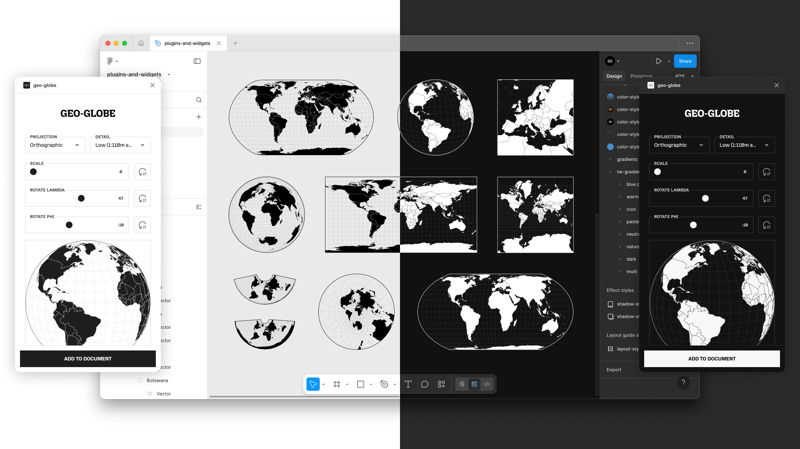

# Geo Globe

**geo-globe** is a Figma plugin that lets you quickly generate and insert precise, projection-based globe vectors, with optional countries, graticules, and outlines.

## Features

- **14 Projection Types**
  - Azimuthal Equal Area
  - Azimuthal Equidistant
  - Gnomonic
  - Orthographic
  - Stereographic
  - Conic Conformal
  - Conic Equal Area
  - Conic Equidistant
  - Albers
  - Equirectangular
  - Mercator
  - Transverse Mercator
  - Equal Earth
  - Natural Earth1

- **Two Detail Levels**
  - Low detail – 1:110m scale
  - High detail – 1:50m scale

- **Projection Controls**
  - Adjust scale and rotation

- **Optional Layers**
  - Country borders
  - Graticules
  - Outline vectors

- **Organized Output**
  - All vectors grouped and named by continent/country

- **Light/Dark Theme Support**
  - Matches your current Figma theme

- **Smart Scaling**
  - Scales to fit selection or viewport

- **Adaptive Fill Colors**
  - Ensures optimal contrast with your page background

## Usage

1. Install the **geo-globe** plugin from Figma Community.
2. Choose a projection type.
3. Select detail level (low or high).
4. Adjust scale and rotation as needed.
5. Toggle optional layers: countries, graticules, outlines.
6. Insert into your Figma canvas.

## Related Plugins

- [geo-country](#) – Continent/country vectors
- [geo-usa](#) – USA nation/state/county vectors

## Dev Info

Built with:

- D3
- TypeScript
- React
- Vite
- colorjs.io
- esbuild
- Figma Plugin API

## License

MIT License